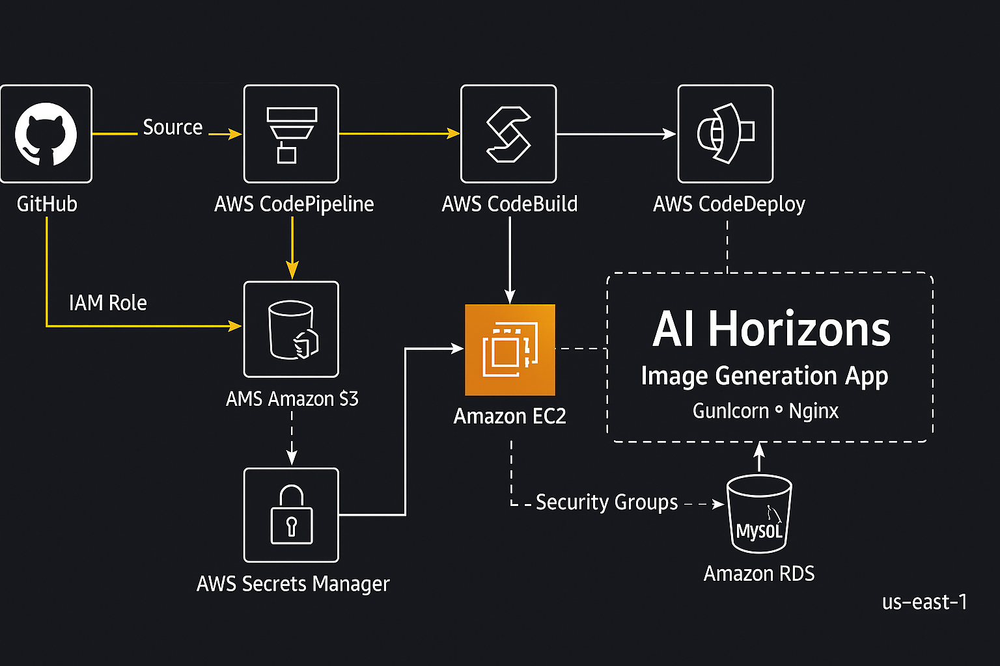

# 🧠 AI Horizons – Image Generation Studio  



AI Horizons is a **cloud-native Python web application** that allows users to generate AI-powered images using Google’s Imagen model.  
It features an interactive **AI Lab** for prompt-based image generation and uses **AWS CI/CD** for automated deployment.

---

## 🚀 Features

- 🎨 **AI Lab** – Enter prompts to generate AI images powered by Google Imagen.
- ⚙️ **Automated CI/CD** – Fully managed using AWS CodePipeline, CodeBuild, and CodeDeploy.
- 🔒 **Secure Secrets Management** – API keys stored in AWS Secrets Manager.
- 🧩 **Database Integration** – MySQL database (local or Amazon RDS) automatically initialized via schema migration.
- 🖥️ **Production Ready Stack** – Flask + Gunicorn + Nginx on Ubuntu EC2.
- ☁️ **Scalable Architecture** – Easily extendable to multiple EC2 instances or containerized environments.

---

## 🏗️ Architecture Overview

The system uses AWS-managed CI/CD services for continuous deployment:

```
GitHub → CodePipeline → CodeBuild → CodeDeploy → EC2 → (Flask + Gunicorn + Nginx)
                                                 ↓
                                           Amazon RDS (MySQL)
                                                 ↓
                                         AWS Secrets Manager
```

---

### 🧱 Components

| Component | Purpose |
|------------|----------|
| **GitHub** | Source control and version management |
| **AWS CodePipeline** | Orchestrates the CI/CD workflow |
| **AWS CodeBuild** | Builds and packages the application |
| **AWS CodeDeploy** | Deploys the app to EC2 with lifecycle hooks |
| **Amazon EC2** | Hosts the Python app (Flask + Gunicorn + Nginx) |
| **Amazon RDS (MySQL)** | Stores user prompts and image metadata |
| **AWS Secrets Manager** | Stores and retrieves API keys securely |

---

## 🧩 Project Structure

```
ai_horizons/
├── app.py
├── config.py                # Stores DB and AWS secret configuration (ignored in git)
├── config_example.py        # Safe version for public reference
├── requirements.txt
├── schema.sql               # MySQL schema for initializing the database
├── templates/               # HTML templates for the frontend
├── static/                  # CSS, JS, and images
├── scripts/
│   ├── install_dependencies.sh
│   ├── migrate_db.sh
│   ├── start_server.sh
│   └── stop_server.sh
├── deploy/
│   ├── ai_horizons.service
│   └── nginx-ai_horizons.conf
└── appspec.yml
```

---

## ⚙️ AWS CI/CD Flow

1. **Developer Pushes Code** → Changes pushed to GitHub trigger **AWS CodePipeline**.  
2. **CodePipeline → CodeBuild** → Builds and prepares the artifact for deployment.  
3. **CodeBuild → CodeDeploy** → Deploys the artifact to EC2.  
4. **CodeDeploy Lifecycle Hooks:**
   - **BeforeInstall** → Stops existing service.
   - **AfterInstall** → Installs Python dependencies and MySQL.
   - **ApplicationStart** → Starts Gunicorn via systemd.
5. **App Running** → Flask served via Gunicorn, proxied by Nginx.

---

## 🧰 Technology Stack

| Layer | Technology |
|--------|-------------|
| Backend | Python (Flask / FastAPI) |
| Frontend | HTML, CSS, JavaScript |
| Web Server | Gunicorn + Nginx |
| Database | MySQL (Local or Amazon RDS) |
| CI/CD | AWS CodePipeline, CodeBuild, CodeDeploy |
| Secrets | AWS Secrets Manager |
| Hosting | Amazon EC2 (Ubuntu 22.04) |

---

## 🔐 Security

- API keys are **never stored in code** – retrieved from **AWS Secrets Manager**.
- EC2 uses IAM Roles for permission-based access.
- Security Groups restrict inbound access (only SSH & HTTP/HTTPS).
- CI/CD pipeline uses least-privilege IAM roles for CodePipeline, CodeBuild, and CodeDeploy.

---

## 🗄️ Database Setup

The MySQL schema (`schema.sql`) is automatically applied during deployment via:
`scripts/migrate_db.sh`

This script:
- Installs MySQL if not already installed.
- Creates the database `ai_horizons_db`.
- Imports schema from `schema.sql`.

For RDS:
Update `DB_HOST` in `migrate_db.sh` and `config.py` to your RDS endpoint.

---

## 🧩 Deployment Scripts Summary

| Script | Purpose |
|---------|----------|
| **install_dependencies.sh** | Creates virtual environment, installs dependencies, copies configs |
| **migrate_db.sh** | Installs MySQL, creates DB, imports schema |
| **start_server.sh** | Starts Gunicorn service via systemd |
| **stop_server.sh** | Stops running Gunicorn service |

---

## ⚙️ Systemd Service (`ai_horizons.service`)

```ini
[Unit]
Description=AI Horizons Python App
After=network.target

[Service]
User=ubuntu
WorkingDirectory=/home/ubuntu/ai_horizons
ExecStart=/home/ubuntu/ai_horizons/venv/bin/gunicorn -w 3 -b 0.0.0.0:8000 app:app
Restart=always
RestartSec=5
TimeoutStopSec=20
Environment="APP_ENV=prod"
Environment="AWS_REGION=us-east-1"

[Install]
WantedBy=multi-user.target
```

---

## 🔄 appspec.yml (CodeDeploy)

```yaml
version: 0.0
os: linux
files:
  - source: /
    destination: /home/ubuntu/ai_horizons
    overwrite: yes
hooks:
  BeforeInstall:
    - location: scripts/stop_server.sh
      runas: root
  AfterInstall:
    - location: scripts/install_dependencies.sh
      runas: root
    - location: scripts/migrate_db.sh
      runas: root
  ApplicationStart:
    - location: scripts/start_server.sh
      runas: root
```

---

## 🔑 Secrets Manager Configuration

In AWS Secrets Manager, store your API key as JSON:

```json
{
  "GOOGLE_API_KEY": "AIzaSyDxxxxxxxxxxxxxxxxxx"
}
```

and name the secret:  
```
ai-horizons-api
```

In `config.py`:
```python
AWS_REGION = 'us-east-1'
AWS_SECRET_NAME = 'ai-horizons-api'
```

---

## 💾 Local Testing (Optional)

To test locally before pushing to GitHub:

```bash
python3 -m venv venv
source venv/bin/activate
pip install -r requirements.txt
python app.py
```

Then visit:
👉 http://localhost:5000  

---

## 🧠 Future Enhancements

- Store generated images in **Amazon S3**
- Add **CloudWatch Logs** for monitoring
- Use **ALB + Auto Scaling** for high availability
- Integrate **HTTPS** using ACM Certificates

---

## 🧾 License

This project is licensed under the **MIT License**.  
You are free to use, modify, and distribute with attribution.

---

## 👨‍💻 Author

**AI Horizons Team**  
Built with ❤️ using **Python, AWS, and CI/CD automation**.
